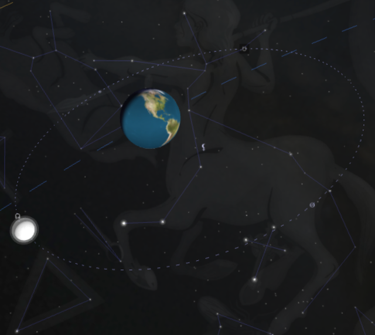
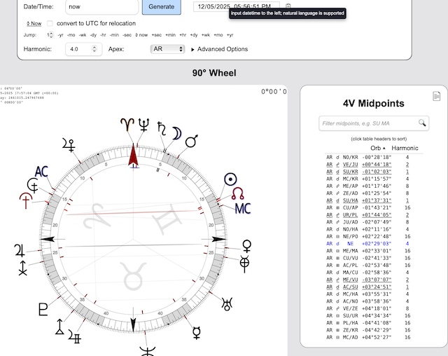

## About Me  ✨🧠🏳️‍🌈🦄

  
  

I'm a curious, creative, and empathetic human with a broad range of interests and experiences. A backend-leaning full-stack polyglot developer, I have worked as a Ruby on Rails consultant for dozens of startups, including LinkedIn, Pioneer Electronics, and Monster.com. I thrive in collaborative environments where integrity, transparency and honesty are strong values. I am also a fan of pair programming and unit tests. You can [view my resume/CV here](DAVID%20LOWENFELS%20CV%20A4.pdf).

I have professional expertise in Web Apps, Hardware/Software Engineering, [Digital Signal Processing](https://soundcloud.com/lowenlabs/theta-bowls), Music, and [Somatic Healing Arts](http://fullspectrumbodywork.com). Some of my personal interests include Breathwork, Qigong, [Applied Neurobiology](http://pranawave.net), [Biochemistry](https://hypochlorous.info), and [Astrology](http://harmonicexplorer.com). I'm also late-diagnosed AuDHD, which explains my broad special interests (polymathy), hyperfocus ability, and out-of-the-box creative problem solving! 

⚡ Fun fact: I was born in Alaska, and lived most of my life in the San Francisco Bay Area (a weird and wonderful melting pot of tech, queerness, relational and embodiment practices, and spirituality). I recently immigrated with my husband to the UK to escape the CA wildfires and have a new adventure (ask me about [Irn Bru](https://www.youtube.com/watch?v=vcQgrYS61Rw), Haribo, crumpets, and wild foraging 😉🏴󠁧󠁢󠁳󠁣󠁴󠁿🏴󠁧󠁢󠁥󠁮󠁧󠁿)

## Open Source Contributions

- [Rails Core](https://contributors.rubyonrails.org/contributors/david-lowenfels/commits) - Contributor to Ruby on Rails framework
- [active_scaffold](https://github.com/activescaffold/active_scaffold) - Made compatible with view_component
- [nih-faust-jit](https://github.com/YPares/nih-faust-jit) - Contributor to JIT-compiled Faust DSP for nih-plug
- [nih-plug](https://github.com/robbert-vdh/nih-plug) - Contributor to the Rust audio plugin framework
- [faustlibraries](https://github.com/grame-cncm/faustlibraries) - Contributor to the official Faust DSP libraries
- [wclap-bridge](https://github.com/niclasberg/wclap-bridge) - Contributor to WebAssembly CLAP plugin bridge
- [visage](https://github.com/VitalAudio/visage) - Contributor to the audio plugin GUI framework
- [t-ruby](https://github.com/niclasberg/t-ruby) - Contributor to Ruby template engine
- [Gradio](https://github.com/gradio-app/gradio) - Contributor to the Python UI library for ML demos

## Astrology Software

- [Harmonic Explorer](https://harmonicexplorer.com) - This experimental multi-tool has received interest from professional astrologers and Human Design analysts. It's a Rails 8 app on Hetzner. The [Heliograph](https://harmonicexplorer.com/heliograph) and [Human Design Transits](https://harmonicexplorer.com/calendars/human_design) showcase particularly complex SVG designs. The [Armillary](https://harmonicexplorer.com/armillary) is a vibecoded 3D planetarium to demonstrate complex astronomical relationships, while the [90º Uranian Dial](https://harmonicexplorer.com/uranian) has some unique JavaScript with Stimulus to highlight precise harmonic midpoint structures used by the Hamburg School.

  
  

- [swe4r](https://github.com/dfl/swe4r) - Ruby bindings for the Swiss Ephemeris library (written in C), providing precise astronomical calculations for astrological software.

- [Astrolog](https://github.com/dfl/Astrolog/tree/gui) - MacOS port of Walter Pullen's classic astrology software. Refactored to use Cairo for vector graphics, making everything SVG native.

## Audio / DSP

- [Löwen Labs Audio](https://dfl.github.io/lowenlabs-audio/) - A collection of browser-based audio synthesis tools built with Web Audio API and AudioWorklets: **DB-303** (circuit-modelled TB-303 clone with DevilFish mods), **KlangwerX** (90s-inspired drum synth), **Funky Monk** (polyphonic formant synth), **BAWD** (binaural beat generator), and **Faveworm** (oscilloscope music visualizer).

  
  
  
  

- [clap-trap](https://github.com/dfl/clap-trap) - A command-line testing tool for CLAP audio plugins. Validates, benchmarks, and renders audio through plugins without requiring a DAW. Supports native `.clap` and WebAssembly plugins via wclap-bridge integration. Useful for CI/CD pipelines to catch plugin bugs before release.

- [frausto](https://github.com/dfl/frausto) - A Ruby toolkit for Faust DSP with bidirectional conversion. Write DSP code in Ruby DSL (`osc(440) >> lp(800) >> gain(0.3)`) and generate Faust, or parse existing Faust into Ruby syntax.

## Selected Projects

- [Internaut Design](https://web.archive.org/web/20140604170316/http://internautdesign.com/ruby_on_rails_consulting) - co-founded a Ruby on Rails consultancy that build MVPs for startups in Silicon Valley. We mentored junior developers and frequently hosted the SF Ruby Meetup. Our in-house project managment tool was so successfull that we spun it out into a SaaS product. 💎
- [ScrumNinja](https://web.archive.org/web/20130605162410/http://www.scrumninja.com/scrum-software) - a project management tool build for Scrum. Inspired by Pivotal Tracker, in addition to high-level user stories and sprint planning, it incorporated a drag-and-drop cardwall for developer task management and time tracking. 🥷
- [Pranawave](http://pranawave.net) - This was a startup that brought together my interests in health, signal processing, bioacoustics, breathing, and Heart Rate Variability. I built versions in Java, Ruby, and Swift. I made it to the finalist pitch round in Y-Combinator, and developed an [iPhone app that measured the pulse via fingertip on camera algorithm](https://www.youtube.com/watch?v=qhjVVUs5u6Q). [2017 YouTube Talk at Consciousness Hacking](https://www.youtube.com/watch?v=lvb7IdhT48c), [2024 Heart Rate Variability Podcast](https://www.youtube.com/watch?v=ZV5i2Fo5DwY). 🫁⚕🫀
- [MindSpa](https://lowenlabs.org/projects/audiovisual/) - I designed and prototyped this brainwave entrainment device during the Pandemic, for some friends who wanted to manufacture and distribute it in China. I used an Arduino platform to build a custom audiovisual synthesis engine, with a complex event sequencer to play back user programs stored on EEPROM. 🧠🚥
- [The Vibrokit](https://fullspectrumbodywork.com/vibrokit) - A hardware retrofit to add vibrotactile bass to massage tables. 🔊

## Technical Biography

I've been programming computers since I was 5 years old, when I explored recursive procedures and [turtle graphics](https://en.wikipedia.org/wiki/Turtle_graphics) with Logo on my Apple 2e.
Thanks to my grade school librarian, I learned to type and program BASIC, later expanding to C, C++, and x86 Assembler.
Between art classes and cross-country running, I spent after-school time at my Dad's office where I learned AutoCAD, digitized maps for a GIS, and wrote a [TSR](https://en.wikipedia.org/wiki/Terminate-and-stay-resident_program) screensaver for MS-DOS.

Between sports practice and language and music lessons, I fell in love with books on 3D graphics and ray tracing. I got an account on a local university [VAX](https://en.wikipedia.org/wiki/VAX) server and explored the worlds of WWW, FTP, and IRC. I learned about VGA register tweaking and [MOD files](https://en.wikipedia.org/wiki/MOD_(file_format)) from the [Demoscene](https://en.wikipedia.org/wiki/Demoscene). Later I became a wannabe cyperpunk hacker and got into [Phreaking](https://en.wikipedia.org/wiki/Phreaking) and [Wardialing](https://en.wikipedia.org/wiki/Wardialing) with my 9600 baud modem, attempted to write my own [BBS](https://en.wikipedia.org/wiki/Bulletin_board_system) software, and created a [Red Box](https://en.wikipedia.org/wiki/Red_box_(phreaking)) by recording SoundBlaster program into my Walkman cassette player. I used the web to learn how to form the [Alaska's first Gay-Straight Alliance](https://github.com/dfl/dfl/blob/8782bd5050d1828ea190844f064f1868aa032c8d/Anchorage_Daily_News_2005_06_24_56.pdf), and published my first HTML site in 1996: a local resource directory for LGBT teens across the state.

Shortly after I majored in EECS and Music (Cello) at MIT, where I learned Scheme, Java, Linux, shell scripting, and analog and digital electronics. I lost the robotics team (terrible at mechanical engineering 🙈), won an award for an analog drum machine (808 and 909 circuits), and produced electronic music (psytrance and breakbeat) for fun. The coolest class I took was [6.004](https://ocw.mit.edu/courses/6-004-computation-structures-spring-2017/) where we built a CPU from scratch using logic gates in SPICE... it's like an electron pinball machine! 🤯 I specialized in Digital Signal Processing, and did a boring thesis on the atmospheric waveguide physics (ask me about the [Schumann Resonances](https://en.wikipedia.org/wiki/Schumann_resonances)). The cherry on top of my education was a year at the Stanford [Center for Computer Research in Music and Acoustics](https://ccrma.stanford.edu) where I experimented with Human-Computer interfaces ([Grid Drum movie](https://www.youtube.com/watch?v=SxJYFXAJmGs)) and [published on Virtual Analog synthesis](https://secure.aes.org/forum/pubs/conventions/?elib=12340).

Failing to find a steady job in the music industry, I got involved with web development, teaching myself PHP, JavaScript, and CSS (remember IE compatibility?! ☠️). I worked as an independent consultant for several years, until I discovered Ruby on Rails, and teamed up with Rodney Carvalho to form Internaut Design during the Web 2.0 boom in Silicon Valley. Thus began my 15+ year career as a Rubyist!

I have greatly enjoyed mentoring junior developers throughout my career -- from in-house training, startup incubation, knowledge transfer at client sites, and time spent at Dev Bootcamp in SF.

Lately for fun, I have been working on [Harmonic Explorer](http://harmonic-explorer.onrender.com), which uses SVG graphics and advanced astronomical calculations to provide tools for professional astrologers. I have also dabbled with [generative AI in Python with diffusers and Gradio](https://github.com/dfl/diffusers-playground), writing Generative Adversarial Network plugins for [ComfyUI](https://github.com/dfl/ComfyUI-StyleGan) and [A111](https://github.com/dfl/sd-webui-gan-generator) that take advantage of it's unique properties for morphing/interpolation in latent space.
